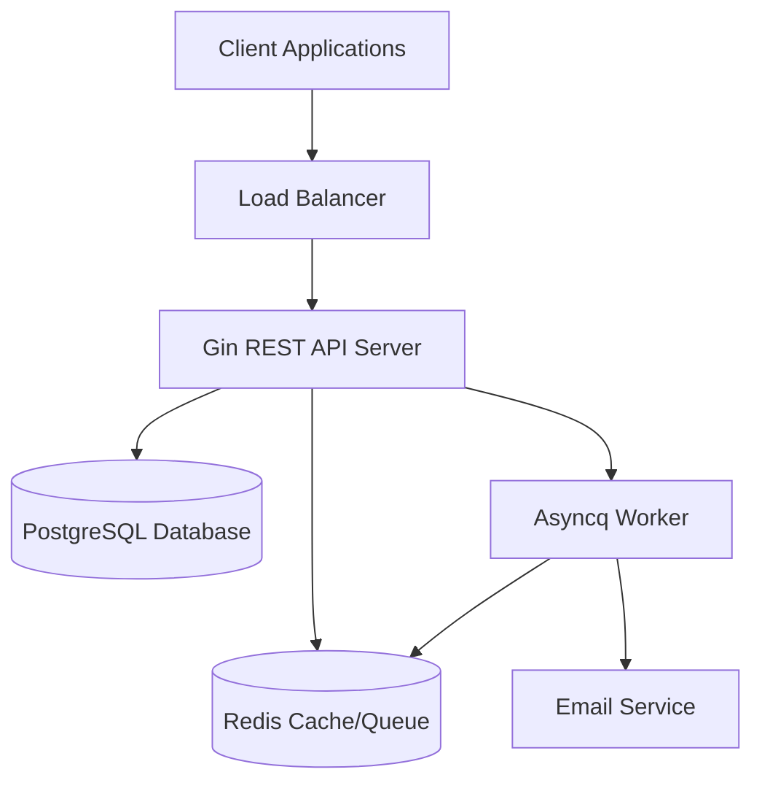
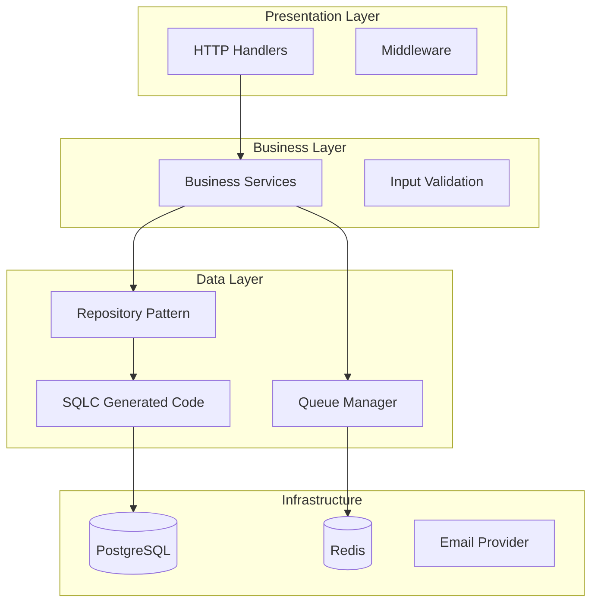
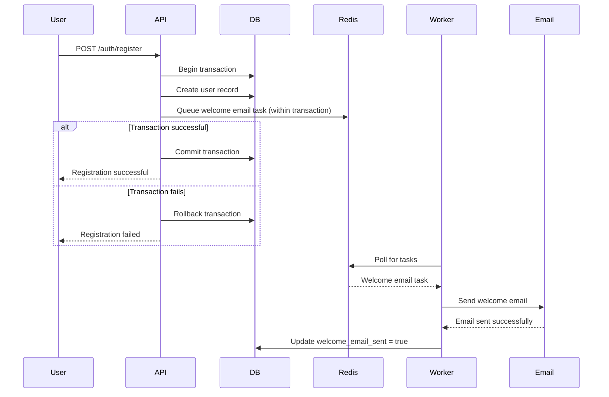

# Design Document

## Overview

The Bank REST API is a microservice built with Go, using the Gin web framework for HTTP handling, SQLC for type-safe database operations with PostgreSQL, and Redis with Asyncq for background job processing. The system provides core banking functionality including multi-currency account management, secure money transfers, and user onboarding with email notifications.

### Key Technologies
- **Go 1.21+**: Latest stable version for optimal performance and security (Requirement 7)
- **Gin v1.9+**: Latest stable lightweight HTTP web framework (Requirement 7)
- **SQLC v1.24+**: Latest stable type-safe SQL code generation (Requirement 7)
- **PostgreSQL 15+**: Primary database for transactional data with ACID compliance
- **Redis 7+**: Message broker for background email jobs (Requirement 8)
- **Asyncq v0.24+**: Latest stable background job processing library for email tasks (Requirement 8)
- **pgx/v5**: Latest stable high-performance PostgreSQL driver (Requirement 7)

## Architecture

### System Architecture



### Layered Architecture



## Components and Interfaces

### Core Components

#### 1. HTTP Server (Gin)
- **Purpose**: Handle HTTP requests and responses
- **Responsibilities**: Routing, middleware, request/response serialization
- **Key Features**: CORS, rate limiting, request logging, error handling

#### 2. Account Service
- **Purpose**: Business logic for account management with multi-currency support (Requirements 1, 2, 4)
- **Methods**:
  - `CreateAccount(userID, currency) (*Account, error)`
  - `GetAccount(accountID) (*Account, error)`
  - `GetUserAccounts(userID) ([]*Account, error)`
  - `UpdateAccount(accountID, updates) error`
  - `DeleteAccount(accountID) error`
- **Key Features**: Currency validation, unique currency per user constraint, zero balance deletion validation, administrative logging

#### 3. Transfer Service
- **Purpose**: Handle money transfers between accounts with full ACID compliance (Requirement 3)
- **Methods**:
  - `TransferMoney(fromAccountID, toAccountID, amount) (*Transfer, error)`
  - `GetTransferHistory(accountID) ([]*Transfer, error)`
- **Key Features**: Database transactions with rollback capability, balance validation, currency matching, atomic operations

#### 4. User Service
- **Purpose**: User management and authentication with welcome email integration (Requirements 8, 9)
- **Methods**:
  - `CreateUser(email, password) (*User, error)`
  - `AuthenticateUser(email, password) (*User, error)`
  - `GetUser(userID) (*User, error)`
  - `MarkWelcomeEmailSent(userID) error`
- **Key Features**: User registration with transactional welcome email queuing, secure authentication, password validation

#### 5. Email Queue Service
- **Purpose**: Background email processing for welcome emails (Requirements 8, 9)
- **Methods**:
  - `QueueWelcomeEmail(userID, email) error`
  - `ProcessWelcomeEmail(task) error`
- **Key Features**: Redis-based task queuing, retry policies, transactional email queuing during user registration

### Database Schema

```sql
-- Users table
CREATE TABLE users (
    id SERIAL PRIMARY KEY,
    email VARCHAR(255) UNIQUE NOT NULL,
    password_hash VARCHAR(255) NOT NULL,
    first_name VARCHAR(100) NOT NULL,
    last_name VARCHAR(100) NOT NULL,
    welcome_email_sent BOOLEAN DEFAULT FALSE,
    created_at TIMESTAMP DEFAULT NOW(),
    updated_at TIMESTAMP DEFAULT NOW()
);

-- Accounts table
CREATE TABLE accounts (
    id SERIAL PRIMARY KEY,
    user_id INTEGER NOT NULL REFERENCES users(id),
    currency VARCHAR(3) NOT NULL,
    balance DECIMAL(15,2) DEFAULT 0.00,
    created_at TIMESTAMP DEFAULT NOW(),
    updated_at TIMESTAMP DEFAULT NOW(),
    UNIQUE(user_id, currency)
);

-- Transfers table
CREATE TABLE transfers (
    id SERIAL PRIMARY KEY,
    from_account_id INTEGER NOT NULL REFERENCES accounts(id),
    to_account_id INTEGER NOT NULL REFERENCES accounts(id),
    amount DECIMAL(15,2) NOT NULL,
    description TEXT,
    status VARCHAR(20) DEFAULT 'completed',
    created_at TIMESTAMP DEFAULT NOW()
);

-- Indexes for performance
CREATE INDEX idx_accounts_user_id ON accounts(user_id);
CREATE INDEX idx_transfers_from_account ON transfers(from_account_id);
CREATE INDEX idx_transfers_to_account ON transfers(to_account_id);
CREATE INDEX idx_transfers_created_at ON transfers(created_at);
```

### API Endpoints

Following RESTful conventions with standard HTTP methods and consistent JSON responses (Requirement 6):

#### Authentication
- `POST /api/v1/auth/register` - User registration (queues welcome email within same transaction)
- `POST /api/v1/auth/login` - User login
- `POST /api/v1/auth/logout` - User logout

#### Account Management (Requirements 1, 2, 4)
- `GET /api/v1/accounts` - List user accounts (user can only access own accounts)
- `POST /api/v1/accounts` - Create new account (validates currency, enforces unique currency per user)
- `GET /api/v1/accounts/:id` - Get account details (returns 404 for non-existent accounts)
- `PUT /api/v1/accounts/:id` - Update account (administrative, excludes direct balance modification)
- `DELETE /api/v1/accounts/:id` - Delete account (requires zero balance, prevents deletion with transactions)

#### Transfers (Requirement 3)
- `POST /api/v1/transfers` - Create money transfer (validates balance, currency matching, uses database transactions)
- `GET /api/v1/transfers` - Get transfer history
- `GET /api/v1/transfers/:id` - Get transfer details

#### Health Check
- `GET /api/v1/health` - Service health status

## Data Models

### Core Entities

```go
type User struct {
    ID               int       `json:"id" db:"id"`
    Email            string    `json:"email" db:"email"`
    PasswordHash     string    `json:"-" db:"password_hash"`
    FirstName        string    `json:"first_name" db:"first_name"`
    LastName         string    `json:"last_name" db:"last_name"`
    WelcomeEmailSent bool      `json:"welcome_email_sent" db:"welcome_email_sent"`
    CreatedAt        time.Time `json:"created_at" db:"created_at"`
    UpdatedAt        time.Time `json:"updated_at" db:"updated_at"`
}

type Account struct {
    ID        int             `json:"id" db:"id"`
    UserID    int             `json:"user_id" db:"user_id"`
    Currency  string          `json:"currency" db:"currency"`
    Balance   decimal.Decimal `json:"balance" db:"balance"`
    CreatedAt time.Time       `json:"created_at" db:"created_at"`
    UpdatedAt time.Time       `json:"updated_at" db:"updated_at"`
}

type Transfer struct {
    ID            int             `json:"id" db:"id"`
    FromAccountID int             `json:"from_account_id" db:"from_account_id"`
    ToAccountID   int             `json:"to_account_id" db:"to_account_id"`
    Amount        decimal.Decimal `json:"amount" db:"amount"`
    Description   string          `json:"description" db:"description"`
    Status        string          `json:"status" db:"status"`
    CreatedAt     time.Time       `json:"created_at" db:"created_at"`
}
```

### Request/Response Models

```go
type CreateAccountRequest struct {
    Currency string `json:"currency" binding:"required,len=3"`
}

type TransferRequest struct {
    FromAccountID int             `json:"from_account_id" binding:"required"`
    ToAccountID   int             `json:"to_account_id" binding:"required"`
    Amount        decimal.Decimal `json:"amount" binding:"required,gt=0"`
    Description   string          `json:"description"`
}

type RegisterRequest struct {
    Email     string `json:"email" binding:"required,email"`
    Password  string `json:"password" binding:"required,min=8"`
    FirstName string `json:"first_name" binding:"required"`
    LastName  string `json:"last_name" binding:"required"`
}

type LoginRequest struct {
    Email    string `json:"email" binding:"required,email"`
    Password string `json:"password" binding:"required,min=8"`
}
```

## Error Handling

### Error Response Format

```go
type ErrorResponse struct {
    Error   string            `json:"error"`
    Message string            `json:"message"`
    Code    int               `json:"code"`
    Details map[string]string `json:"details,omitempty"`
}
```

### Error Categories (Requirement 5)

1. **Validation Errors (400)**: Invalid input data, invalid currency codes
2. **Authentication Errors (401)**: Invalid credentials, unauthorized access
3. **Authorization Errors (403)**: Insufficient permissions, accessing other user's accounts
4. **Not Found Errors (404)**: Resource not found, non-existent accounts
5. **Business Logic Errors (422)**: Insufficient balance, currency mismatch, duplicate currency accounts, non-zero balance deletion
6. **Rate Limiting Errors (429)**: Too many requests exceeded
7. **Server Errors (500)**: Database errors, external service failures (generic messages without internal details)

### Database Transaction Error Handling

#### Transfer Operations (Requirement 3)

**Design Rationale**: All transfer operations must be atomic to ensure data consistency. If any part of the transfer fails, the entire operation is rolled back to maintain account balance integrity.

```go
func (s *TransferService) TransferMoney(ctx context.Context, req TransferRequest) (*Transfer, error) {
    tx, err := s.db.BeginTx(ctx, nil)
    if err != nil {
        return nil, fmt.Errorf("failed to begin transaction: %w", err)
    }
    defer tx.Rollback() // Ensures rollback if commit is not reached

    // 1. Validate accounts exist and belong to authorized users
    // 2. Check sufficient balance in source account
    // 3. Verify currency matching between accounts
    // 4. Deduct from source account
    // 5. Add to destination account
    // 6. Record transfer transaction
    // If any step fails, transaction will be rolled back automatically
    
    if err := tx.Commit(); err != nil {
        return nil, fmt.Errorf("failed to commit transaction: %w", err)
    }
    
    return transfer, nil
}
```

#### User Registration with Email Queuing (Requirements 8, 9)

**Design Rationale**: User creation and welcome email queuing must be atomic to ensure that welcome emails are only sent for successfully created users. This prevents orphaned email tasks and maintains data consistency.

```go
func (s *UserService) CreateUser(ctx context.Context, req RegisterRequest) (*User, error) {
    tx, err := s.db.BeginTx(ctx, nil)
    if err != nil {
        return nil, fmt.Errorf("failed to begin transaction: %w", err)
    }
    defer tx.Rollback() // Ensures rollback if commit is not reached

    // 1. Validate user input (email uniqueness, password strength)
    // 2. Hash password securely
    // 3. Create user record in database
    // 4. Queue welcome email task in Redis (within same transaction)
    // If any step fails, transaction will be rolled back automatically
    
    if err := tx.Commit(); err != nil {
        return nil, fmt.Errorf("failed to commit transaction: %w", err)
    }
    
    return user, nil
}
```

## Testing Strategy

### Unit Testing
- **Coverage Target**: 80%+ code coverage
- **Framework**: Go's built-in testing package with testify
- **Mocking**: Mockery for interface mocking
- **Database**: In-memory SQLite for isolated tests

### Integration Testing
- **Database**: Docker PostgreSQL container
- **Redis**: Docker Redis container
- **HTTP Testing**: httptest package for API endpoint testing

### End-to-End Testing
- **Environment**: Docker Compose with all services
- **Test Data**: Fixtures and factories for consistent test data
- **Scenarios**: Complete user workflows from registration to transfers

### Performance Testing
- **Load Testing**: Artillery.js or similar tools
- **Metrics**: Response time, throughput, error rates
- **Database**: Connection pooling and query optimization

## Welcome Email Workflow (Requirements 8, 9)

### Design Rationale
The welcome email system is designed as an asynchronous background process that is transactionally coupled with user registration to ensure data consistency. This approach avoids blocking user registration operations while guaranteeing that welcome emails are only queued for successfully created users.

### Workflow Process


### Key Components
- **Transactional Integrity**: User creation and email queuing happen within a single database transaction (Requirements 8, 9)
- **Task Queuing**: Redis-based job queue using Asyncq, queued only after successful user creation
- **Background Processing**: Separate worker process for email tasks
- **Retry Logic**: Configurable retry policy for failed email deliveries
- **Idempotency**: Prevents duplicate welcome emails through database flag
- **Rollback Safety**: If user creation fails, no welcome email task is queued

## Security Considerations

### Authentication & Authorization
- **PASETO Tokens**: Secure, stateless authentication with configurable expiration (more secure than JWT)
- **Password Hashing**: bcrypt with appropriate cost factor
- **Rate Limiting**: Per-IP and per-user rate limits (Requirement 5)

### Data Protection
- **Input Validation**: Comprehensive validation using Gin's binding
- **SQL Injection**: SQLC generates safe, parameterized queries
- **Sensitive Data**: Environment variables for secrets, no hardcoded credentials (Requirement 9)

### API Security
- **CORS**: Configurable CORS policies
- **HTTPS**: TLS termination at load balancer
- **Request Logging**: Structured logging without sensitive data

## Configuration Management

### Environment Variables (Requirement 10)

**Design Rationale**: All sensitive information is stored in environment variables and excluded from version control to maintain security best practices.

```bash
# Database
DB_HOST=localhost
DB_PORT=5432
DB_NAME=bankapi
DB_USER=bankuser
DB_PASSWORD=secure_password  # Excluded from Git via .gitignore
DB_SSL_MODE=require

# Redis
REDIS_HOST=localhost
REDIS_PORT=6379
REDIS_PASSWORD=redis_password  # Excluded from Git via .gitignore

# PASETO
PASETO_SECRET_KEY=your_paseto_secret_key  # Excluded from Git via .gitignore
PASETO_EXPIRATION=24h

# Email (Requirements 8, 9)
SMTP_HOST=smtp.gmail.com
SMTP_PORT=587
SMTP_USERNAME=your_email@gmail.com
SMTP_PASSWORD=your_app_password  # Excluded from Git via .gitignore

# Server
PORT=8080
GIN_MODE=release
```

### Configuration Structure
```go
type Config struct {
    Database DatabaseConfig `mapstructure:"database"`
    Redis    RedisConfig    `mapstructure:"redis"`
    PASETO   PASETOConfig   `mapstructure:"paseto"`
    Email    EmailConfig    `mapstructure:"email"`
    Server   ServerConfig   `mapstructure:"server"`
}
```

## Deployment Architecture

### Docker Configuration
- **Multi-stage builds**: Optimized container images
- **Health checks**: Container health monitoring
- **Resource limits**: CPU and memory constraints

### Infrastructure
- **Database**: PostgreSQL with connection pooling
- **Cache**: Redis cluster for high availability and email job queuing
- **Monitoring**: Prometheus metrics and Grafana dashboards
- **Logging**: Structured JSON logging with log aggregation (administrative actions logged per Requirement 4)

### Version Control Setup (Requirement 10)
- **Git Repository**: Initialized with proper .gitignore
- **Security**: Database passwords, API keys, and access tokens excluded from version control
- **Environment Files**: .env files excluded from Git, with .env.example provided for setup guidance