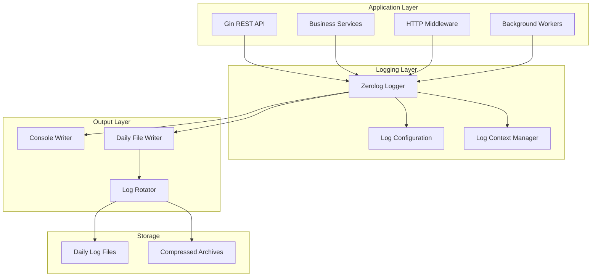
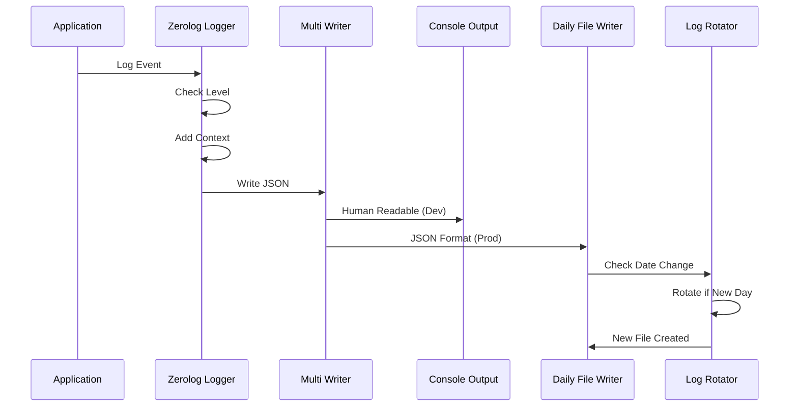

# Design Document

## Overview

This design implements a migration from logrus to zerolog for the Bank REST API, introducing high-performance structured logging with daily timestamped log files and automatic rotation. The system will maintain all existing logging functionality while significantly improving performance and adding advanced log management features.

### Key Technologies
- **zerolog v1.33+**: High-performance structured logging library with zero allocations
- **lumberjack v2.2+**: Log rotation library for daily file management and cleanup
- **Go 1.21+**: Leveraging latest Go features for optimal performance

### Performance Benefits
- **Zero Allocations**: zerolog's design eliminates memory allocations during logging
- **Structured JSON**: Native JSON output without reflection overhead
- **Conditional Logging**: Efficient level-based filtering with minimal overhead
- **Fast Serialization**: Optimized JSON marshaling for high-throughput scenarios

## Architecture

### Logging Architecture



### Log Flow Architecture



## Components and Interfaces

### Core Components

#### 1. Logger Configuration

```go
type LogConfig struct {
    Level           string        `mapstructure:"level" default:"info"`
    Format          string        `mapstructure:"format" default:"json"`
    Output          string        `mapstructure:"output" default:"both"`
    Directory       string        `mapstructure:"directory" default:"logs"`
    MaxAge          int           `mapstructure:"max_age" default:"30"`
    MaxBackups      int           `mapstructure:"max_backups" default:"10"`
    MaxSize         int           `mapstructure:"max_size" default:"100"`
    Compress        bool          `mapstructure:"compress" default:"true"`
    LocalTime       bool          `mapstructure:"local_time" default:"true"`
    CallerInfo      bool          `mapstructure:"caller_info" default:"false"`
    SamplingEnabled bool          `mapstructure:"sampling_enabled" default:"false"`
    SamplingInitial int           `mapstructure:"sampling_initial" default:"100"`
    SamplingThereafter int        `mapstructure:"sampling_thereafter" default:"100"`
}
```

#### 2. Logger Manager

**Purpose**: Central logger management with configuration and context handling (Requirements 1, 4)

```go
type LoggerManager struct {
    logger     zerolog.Logger
    config     LogConfig
    fileWriter io.Writer
    multiWriter io.Writer
}

// Methods
func NewLoggerManager(config LogConfig) (*LoggerManager, error)
func (lm *LoggerManager) GetLogger() zerolog.Logger
func (lm *LoggerManager) GetContextLogger(ctx context.Context) zerolog.Logger
func (lm *LoggerManager) WithFields(fields map[string]interface{}) zerolog.Logger
func (lm *LoggerManager) Close() error
```

#### 3. Daily File Writer

**Purpose**: Handle daily log file creation and rotation (Requirement 2)

```go
type DailyFileWriter struct {
    directory    string
    filename     string
    currentFile  *os.File
    currentDate  string
    maxAge       int
    maxBackups   int
    compress     bool
    localTime    bool
    mu           sync.Mutex
}

// Methods
func NewDailyFileWriter(config DailyFileConfig) (*DailyFileWriter, error)
func (dfw *DailyFileWriter) Write(p []byte) (n int, err error)
func (dfw *DailyFileWriter) Rotate() error
func (dfw *DailyFileWriter) Cleanup() error
func (dfw *DailyFileWriter) Close() error
```

#### 4. Context Logger

**Purpose**: Request-scoped logging with contextual information (Requirement 3)

```go
type ContextLogger struct {
    logger    zerolog.Logger
    requestID string
    userID    int64
    userEmail string
    fields    map[string]interface{}
}

// Methods
func NewContextLogger(logger zerolog.Logger, ctx context.Context) *ContextLogger
func (cl *ContextLogger) WithRequestID(requestID string) *ContextLogger
func (cl *ContextLogger) WithUser(userID int64, email string) *ContextLogger
func (cl *ContextLogger) WithFields(fields map[string]interface{}) *ContextLogger
func (cl *ContextLogger) Info() *zerolog.Event
func (cl *ContextLogger) Error() *zerolog.Event
func (cl *ContextLogger) Debug() *zerolog.Event
func (cl *ContextLogger) Warn() *zerolog.Event
```

#### 5. Audit Logger

**Purpose**: Specialized logging for security and audit events (Requirement 5)

```go
type AuditLogger struct {
    logger zerolog.Logger
}

// Methods
func NewAuditLogger(logger zerolog.Logger) *AuditLogger
func (al *AuditLogger) LogAuthentication(userID int64, email, action, result string)
func (al *AuditLogger) LogAccountOperation(userID int64, accountID int64, operation, result string)
func (al *AuditLogger) LogTransfer(fromAccount, toAccount int64, amount decimal.Decimal, result string)
func (al *AuditLogger) LogAdminAction(adminID int64, action, target, result string)
func (al *AuditLogger) LogSecurityEvent(event, source, details string)
```

#### 6. Performance Logger

**Purpose**: Performance metrics and monitoring (Requirement 6)

```go
type PerformanceLogger struct {
    logger zerolog.Logger
}

// Methods
func NewPerformanceLogger(logger zerolog.Logger) *PerformanceLogger
func (pl *PerformanceLogger) LogHTTPRequest(method, path string, duration time.Duration, status int)
func (pl *PerformanceLogger) LogDatabaseQuery(query string, duration time.Duration, rowsAffected int64)
func (pl *PerformanceLogger) LogBackgroundJob(jobType string, duration time.Duration, success bool)
func (pl *PerformanceLogger) LogResourceUsage(cpu, memory float64)
func (pl *PerformanceLogger) LogExternalService(service string, duration time.Duration, success bool)
```

### File Naming and Rotation Strategy

#### Daily Log Files (Requirement 2)

**File Naming Convention**:
- Current log: `app-YYYY-MM-DD.log`
- Rotated logs: `app-YYYY-MM-DD.log.gz` (compressed)
- Example: `app-2024-01-15.log`, `app-2024-01-14.log.gz`

**Rotation Logic**:
```go
func (dfw *DailyFileWriter) shouldRotate() bool {
    currentDate := time.Now().Format("2006-01-02")
    return dfw.currentDate != currentDate
}

func (dfw *DailyFileWriter) getLogFileName(date string) string {
    return filepath.Join(dfw.directory, fmt.Sprintf("app-%s.log", date))
}
```

#### Cleanup Strategy (Requirement 7)

**Retention Policies**:
- **MaxAge**: Remove files older than N days
- **MaxBackups**: Keep only N most recent backup files
- **Compression**: Compress rotated files to save space
- **Cleanup Schedule**: Run cleanup on each rotation

```go
func (dfw *DailyFileWriter) cleanupOldFiles() error {
    files, err := filepath.Glob(filepath.Join(dfw.directory, "app-*.log*"))
    if err != nil {
        return err
    }
    
    // Sort files by modification time
    sort.Slice(files, func(i, j int) bool {
        infoI, _ := os.Stat(files[i])
        infoJ, _ := os.Stat(files[j])
        return infoI.ModTime().After(infoJ.ModTime())
    })
    
    // Apply retention policies
    return dfw.applyRetentionPolicies(files)
}
```

## Migration Strategy

### Phase 1: Core Logger Setup

**Objective**: Replace logrus with zerolog while maintaining existing functionality

1. **Add zerolog dependency** to go.mod
2. **Create logger configuration** structure
3. **Implement LoggerManager** with basic functionality
4. **Create daily file writer** with rotation logic
5. **Set up multi-writer** for console and file output

### Phase 2: Middleware Migration

**Objective**: Update HTTP middleware to use zerolog

1. **Update RequestLogger middleware** to use zerolog
2. **Maintain existing log fields** and sensitive data filtering
3. **Add request ID correlation** for tracing
4. **Implement contextual logging** for request scope
5. **Add performance metrics** logging

### Phase 3: Service Layer Integration

**Objective**: Integrate zerolog throughout business services

1. **Update all service constructors** to accept logger
2. **Add contextual logging** to service methods
3. **Implement audit logging** for sensitive operations
4. **Add database operation logging** with performance metrics
5. **Update error handling** with structured error logging

### Phase 4: Background Job Logging

**Objective**: Add structured logging to background workers

1. **Update Asyncq worker logging** to use zerolog
2. **Add job execution metrics** and timing
3. **Implement job correlation IDs** for tracing
4. **Add retry and failure logging** with context
5. **Monitor job queue health** with logging

## Configuration Management

### Environment Variables (Requirement 4)

```bash
# Logging Configuration
LOG_LEVEL=info                    # debug, info, warn, error, fatal
LOG_FORMAT=json                   # json, console
LOG_OUTPUT=both                   # console, file, both
LOG_DIRECTORY=logs               # Directory for log files
LOG_MAX_AGE=30                   # Days to keep log files
LOG_MAX_BACKUPS=10               # Number of backup files to keep
LOG_MAX_SIZE=100                 # Maximum size in MB before rotation
LOG_COMPRESS=true                # Compress rotated files
LOG_LOCAL_TIME=true              # Use local time for file names
LOG_CALLER_INFO=false            # Include caller information
LOG_SAMPLING_ENABLED=false       # Enable log sampling for high volume
LOG_SAMPLING_INITIAL=100         # Initial sampling rate
LOG_SAMPLING_THEREAFTER=100      # Subsequent sampling rate
```

### Configuration Structure

```go
type Config struct {
    // ... existing config fields
    Logging LogConfig `mapstructure:"logging"`
}

func LoadConfig() (*Config, error) {
    config := &Config{
        Logging: LogConfig{
            Level:      getEnv("LOG_LEVEL", "info"),
            Format:     getEnv("LOG_FORMAT", "json"),
            Output:     getEnv("LOG_OUTPUT", "both"),
            Directory:  getEnv("LOG_DIRECTORY", "logs"),
            MaxAge:     getEnvInt("LOG_MAX_AGE", 30),
            MaxBackups: getEnvInt("LOG_MAX_BACKUPS", 10),
            MaxSize:    getEnvInt("LOG_MAX_SIZE", 100),
            Compress:   getEnvBool("LOG_COMPRESS", true),
            LocalTime:  getEnvBool("LOG_LOCAL_TIME", true),
        },
    }
    return config, nil
}
```

## Log Format and Structure

### JSON Log Format (Production)

```json
{
  "timestamp": "2024-01-15T10:30:45.123Z",
  "level": "info",
  "message": "Request completed",
  "request_id": "20240115103045-abc12345",
  "user_id": 123,
  "user_email": "user@example.com",
  "method": "POST",
  "path": "/api/v1/transfers",
  "status": 200,
  "duration_ms": 45,
  "client_ip": "192.168.1.100",
  "user_agent": "Mozilla/5.0...",
  "request_body": {
    "from_account_id": 1,
    "to_account_id": 2,
    "amount": "100.00",
    "password": "[REDACTED]"
  },
  "response_size": 256
}
```

### Console Format (Development)

```
2024-01-15T10:30:45Z INF Request completed 
    request_id=20240115103045-abc12345 
    user_id=123 
    method=POST 
    path=/api/v1/transfers 
    status=200 
    duration_ms=45
```

### Audit Log Format (Requirement 5)

```json
{
  "timestamp": "2024-01-15T10:30:45.123Z",
  "level": "info",
  "message": "Money transfer completed",
  "log_type": "audit",
  "event_type": "transfer",
  "user_id": 123,
  "user_email": "user@example.com",
  "from_account_id": 1,
  "to_account_id": 2,
  "amount": "100.00",
  "currency": "USD",
  "transaction_id": "txn_abc123",
  "result": "success",
  "request_id": "20240115103045-abc12345"
}
```

## Error Handling and Logging

### Error Log Structure

```go
type ErrorContext struct {
    RequestID   string                 `json:"request_id,omitempty"`
    UserID      int64                  `json:"user_id,omitempty"`
    Operation   string                 `json:"operation,omitempty"`
    Component   string                 `json:"component,omitempty"`
    Details     map[string]interface{} `json:"details,omitempty"`
    StackTrace  string                 `json:"stack_trace,omitempty"`
}

func LogError(logger zerolog.Logger, err error, ctx ErrorContext) {
    event := logger.Error().
        Err(err).
        Str("request_id", ctx.RequestID).
        Int64("user_id", ctx.UserID).
        Str("operation", ctx.Operation).
        Str("component", ctx.Component)
    
    if ctx.Details != nil {
        event = event.Interface("details", ctx.Details)
    }
    
    if ctx.StackTrace != "" {
        event = event.Str("stack_trace", ctx.StackTrace)
    }
    
    event.Msg("Operation failed")
}
```

### Database Error Logging

```go
func LogDatabaseError(logger zerolog.Logger, query string, err error, duration time.Duration) {
    logger.Error().
        Err(err).
        Str("component", "database").
        Str("query", sanitizeQuery(query)).
        Dur("duration", duration).
        Msg("Database operation failed")
}
```

## Performance Considerations

### Zerolog Performance Benefits

1. **Zero Allocations**: No memory allocations during logging operations
2. **Lazy Evaluation**: Log fields are only evaluated if the log level is enabled
3. **Efficient JSON**: Direct JSON writing without reflection
4. **Conditional Compilation**: Debug logs can be completely removed in production builds

### Sampling Configuration (High Volume Scenarios)

```go
// Enable sampling for high-volume endpoints
sampledLogger := logger.Sample(&zerolog.BasicSampler{N: 10}) // Log every 10th message

// Use different sampling rates for different log levels
sampledLogger := logger.Sample(&zerolog.LevelSampler{
    InfoSampler:  &zerolog.BasicSampler{N: 10},
    WarnSampler:  &zerolog.BasicSampler{N: 5},
    ErrorSampler: nil, // Log all errors
})
```

### File I/O Optimization

```go
// Use buffered writer for better performance
bufWriter := bufio.NewWriterSize(fileWriter, 64*1024) // 64KB buffer

// Periodic flush to ensure data persistence
go func() {
    ticker := time.NewTicker(5 * time.Second)
    defer ticker.Stop()
    for range ticker.C {
        bufWriter.Flush()
    }
}()
```

## Testing Strategy

### Unit Testing
- **Logger Configuration**: Test configuration loading and validation
- **File Rotation**: Test daily rotation logic and file naming
- **Context Logging**: Test contextual field addition and correlation
- **Sensitive Data Filtering**: Test redaction of sensitive information

### Integration Testing
- **End-to-End Logging**: Test complete request logging flow
- **File Management**: Test log file creation, rotation, and cleanup
- **Performance Impact**: Measure logging overhead and throughput
- **Error Scenarios**: Test logging behavior during failures

### Performance Testing
- **Throughput**: Measure logs per second under load
- **Memory Usage**: Monitor memory allocation patterns
- **File I/O**: Test file writing performance and rotation impact
- **Concurrent Access**: Test thread safety and concurrent logging

## Security and Compliance

### Sensitive Data Protection (Requirements 3, 5)

**Automatic Redaction**:
- Passwords, tokens, API keys
- Credit card numbers, SSNs
- Personal identification information
- Authentication headers and cookies

**Audit Trail Requirements**:
- User authentication events
- Account operations (create, update, delete)
- Money transfers and financial transactions
- Administrative actions
- Security events and failures

### Log File Security

**File Permissions**:
- Log files: 640 (owner read/write, group read)
- Log directory: 750 (owner full, group read/execute)
- Rotation preserves permissions

**Access Control**:
- Restrict log file access to application user and log group
- Implement log file encryption for sensitive environments
- Secure log file transmission for centralized logging

## Monitoring and Alerting

### Log-Based Metrics

**Error Rate Monitoring**:
- Track error log frequency by component
- Alert on error rate spikes
- Monitor specific error patterns

**Performance Monitoring**:
- Track request duration percentiles
- Monitor database query performance
- Alert on performance degradation

**Security Monitoring**:
- Failed authentication attempts
- Unusual access patterns
- Rate limiting triggers

### Health Checks

```go
func (lm *LoggerManager) HealthCheck() error {
    // Check if log directory is writable
    testFile := filepath.Join(lm.config.Directory, ".health_check")
    if err := os.WriteFile(testFile, []byte("test"), 0644); err != nil {
        return fmt.Errorf("log directory not writable: %w", err)
    }
    os.Remove(testFile)
    
    // Check disk space
    if available, err := getDiskSpace(lm.config.Directory); err != nil {
        return fmt.Errorf("cannot check disk space: %w", err)
    } else if available < 100*1024*1024 { // 100MB minimum
        return fmt.Errorf("insufficient disk space: %d bytes available", available)
    }
    
    return nil
}
```